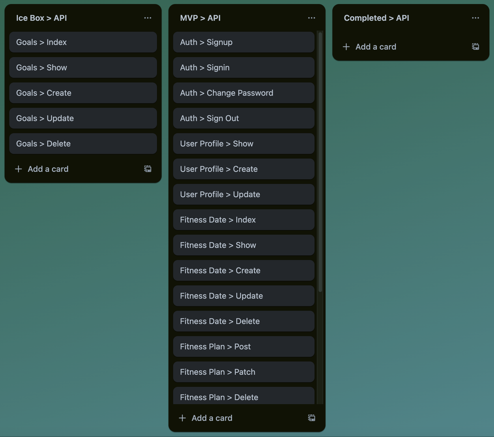

# Health API

The Health API will manage create, read, update, and delete functionality for:
- Users (including authentication and authorization using token auth)
- Fitness Dates - a set of information for a user on a specific date to manage their health plans and goals for that date
- Fitness Plans - details on classes, exercises, etc that a user plans for a particular date

It will be utilized by the **Health Oasis** client application. (URL coming soon!)


## API Functionality

### User Authentication

- AAV, I want to sign up for Health Oasis
- AAU, I want to sign into my account with Health Oasis
- AAU, I want to change my password
- AAU, I want to sign out of my account

### User Profile

- AAU, I want to see my user profile
- AAU, I want to update my user profile

### Health Date

Note: A user will not have a health date created for a specific date until they begin to plan healthy activities for that day.

- AAU, I want to get all the dates I have plans created for
- AAU, I want to get a specific date and all the information associated with it
- AAU, I want to create a new date that I can associate health plans with
- AAU, I want to update the focus area and personal statement for a particular date
- AAU, I want to delete everything associated with a health date in case I decide to forget that whole plan


### Fitness Plans

- AAU, I want to add a class that I plan on going to on a particular date
- AAU, I want to add an exercise that I plan on doing on a particular date




## ERD


## Routes

### Authentication Routes

| Verb   | URI Pattern            | Controller#Action |
|--------|------------------------|-------------------|
| POST   | `/sign-up`             | `users#signup`    |
| POST   | `/sign-in`             | `users#signin`    |
| PATCH  | `/change-password`     | `users#changepw`  |
| DELETE | `/sign-out`            | `users#signout`   |


### User Profile Routes

| Verb   | URI Pattern            | Controller#Action |
|--------|------------------------|-------------------|
| GET    | `/profile`             | `users#profile`   |
| PATCH  | `/profile`             | `users#changeprofile` |


### My Health Date Routes

| Verb   | URI Pattern            | Controller#Action |
|--------|------------------------|-------------------|
| GET   | `/dates`                | `health_date#index`   |
| GET   | `/dates/:id`            | `health_date#show`    |
| POST   | `/dates`               | `health_date#create`  |
| PATCH  | `/dates/:id`           | `health_date#update`  |
| DELETE | `/dates/:id`           | `health_date#delete`  |


### Fitness Plan Routes

| Verb   | URI Pattern              | Controller#Action |
|--------|--------------------------|-------------------|
| POST   | `/fitness/:healthDateId` | `fitnessPlan#create`  |
| POST   | `/fitness/:healthDateId/:fitnessPlanId` | `fitnessPlan#update`  |
| POST   | `/fitness/:healthDateId/:fitnessPlanId` | `fitnessPlan#delete`  |


## Technologies Used

- MERN Stack - API 
- MongoDB, including discriminators
- Mongoose
- Express.js


## Next Steps / Ice Box

Coming soon...


## More Information on API Usage of MongoDB Discriminators

MongoDB provides discriminators to enable schema inheritance and to model object-oriented inheritance.

I plan to use discriminators in the implementation of `FitnessPlan`, `ClassPlan`, and `ExercisePlan`.

In OOP terms, these resources would be organized as follows:

```js
class FitnessPlan {
    // common fields between ClassPlan, ExercisePlan, and any future type of FitnessPlan
    ...
}

class ClassPlan extends FitnessPlan {
    // class-specific fields, such as host, location, time, isVirtual
    ...
}

class ExercisePlan extends FitnessPlan {
    // exercise-specific fields, such as reps, sets
    ...
}
```


### Health API's Models

```js
// General FitnessPlan
const fitnessPlanSchema = new mongoose.Schema(
    {
        ... // common attributes
    }
    , {
        timestamps: true,
        toObject: { virtuals: true },
        toJSON: { virtuals: true },
        discriminatorKey: 'kind',
    }
);
const FitnessPlan = mongoose.model('FitnessPlan', fitnessPlanSchema);

// ClassPlan is a special type of FitnessPlan with class name, time, location, etc. details
const ClassPlan = FitnessPlan.discriminator('ClassPlan',
  new mongoose.Schema({
        // class name
        // class host
        // class location
        ... // other class-specific attributes
    }
    , {
        timestamps: true,
        toObject: { virtuals: true },
        toJSON: { virtuals: true },
        discriminatorKey: 'kind',
    }
));

// likewise for Exercise Plan...
```

All of these entities will be stored in one collection in the database as sub-documents on `FitnessDate`

### CRUD for Health API's Models

When using these models in Create and Update, I can just use one route for both models as long as the `type` discriminator key is passed and set to the appropriate fitness plan type.

I should be able to have one Delete route as I'm just deleting by ID, but I'll use Postman to test that theory out.  Worse case, I create two routes.

When reading, I plan to retrieve all `FitnessPlan` at once (irrespective of type) and use the `discriminatorKey` (set on creation) or virtuals to distinguish `ClassPlan` from `ExercisePlan` so the show pages can be rendered appropriately


### Sources of info on discriminators

Mongoose Docs: https://mongoosejs.com/docs/discriminators.html

Other Site: https://techinsights.manisuec.com/mongodb/mongoose-discriminator-non-dry-way-inherit-properties/

Embedding Discriminators (available in Mongoose 4.8): https://thecodebarbarian.com/mongoose-4.8-embedded-discriminators.html


### Fallback Options

If I cannot get discriminators to work as expected, my second option is to store the `ClassPlan` and `ExercisePlan` as a sub-document on `FitnessPlan`.  They would both have to be nullable as a `FitnessPlan` will only have one or the other.

The third option is to eliminate `FitnessPlan` altogether and store a collection of `ClassPlan` directly on `FitnessDate` as well as a collection of `ExercisePlan` on `FitnessDate`.  This is not DRY as the common attributes would need to be on both `ClassPlan` and `ExercisePlan` but it would work.